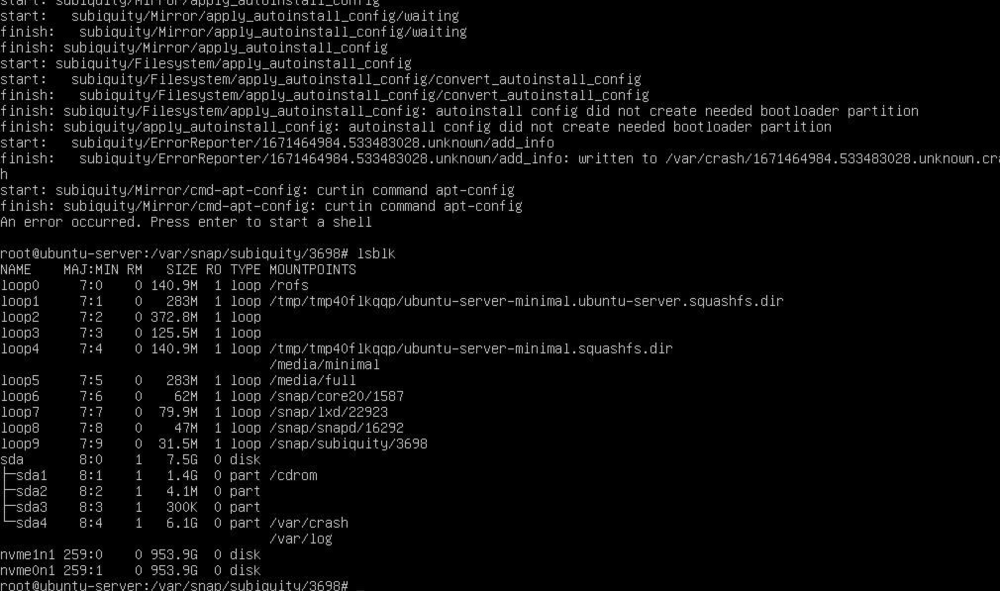

# Cloud in a Box

Cloud in a Box is a minimalistic installation of OSISM with only services which are needed to make it run.
For more information you can consult the [Testbed](https://docs.osism.tech/testbed/index.html) documentation.
If you want to have a full installation please have a look at the [OSISM](https://docs.osism.tech/) documentation.

> **Warning:**
> The secrets are stored in plain text and are not secure. Do not use for publicly
> accessible systems.

## Requirements

* The first blockdevice is available as `/dev/sda` or `/dev/nvme0n1`.
* USB stick with at least 2GB capacity.
* CPU: 1 socket, 4 cores
* RAM: 32 GB
* Storage: 1 TB
* Network: 1 network interfaces

## Download the Cloud in a Box image

> **Warning:** ⚡ When booting from this image, all data on the hard disks will be destroyed without confirmation.

* <https://minio.services.osism.tech/node-image/ubuntu-autoinstall-cloud-in-a-box-1.iso> (with /dev/sda)
* <https://minio.services.osism.tech/node-image/ubuntu-autoinstall-cloud-in-a-box-2.iso> (with /dev/nvme0n1)

## Getting started

Download the Cloud in a Box image from the link above.

Use a tool to create a bootable USB stick with the Cloud in a Box image.

Boot from the USB stick.

The installation will start and take a few minutes. After that the system will shutdown.

Remove the USB stick and restart the system.

The deployment will start. This takes some time and the system will shutdown when the deployment is finished.
This takes roughly an hour, possibly longer depending on the hardware and internet connection.

System is ready for use, by default DHCP is tried on the first network device.

Login via ssh. Use the user **dragon** with the password **password**.

```bash
ssh dragon@IP_FROM_YOUR_SERVER
```

Copy the `/home/dragon/wireguard-client.conf` file to your device. This is necessary for using the web endpoints on your device.
Rename the wireguard config file to something like `ciab.conf`.
If you want to connect to the cloud-in-a-box system from multiple clients, change the client IP in the config file to be
different on each client.
> **Note:**
> Be aware that the name does not contain any special characters!

```bash
scp dragon@IP_FROM_YOUR_SERVER:/home/dragon/wireguard-client.conf /home/ubuntu/ciab.conf
```

Install wireguard on your device, if you have not done this before. For instructions how to do it on your device, please have
a look on the documentation of your used distribution.
The wireguard documentation you will find [here](https://www.wireguard.com/).

Start the wireguard tunnel.

```bash
wg-quick up /home/ubuntu/ciab.conf
```

Now your Cloud in a Box is up and you can reach the most services via the Homer dashboard:
<https://homer.services.in-a-box.cloud>

If you want to access the services directly please choose the URL from the following list:

| Name              | URL                                           | Username  | Password                                 |
|-------------------|-----------------------------------------------|-----------|------------------------------------------|
| ARA               | <https://ara.services.in-a-box.cloud>         | ara       | password                                 |
| Flower            | <https://flower.services.in-a-box.cloud>      | -         | -                                        |
| Grafana           | <https://api.in-a-box.cloud:3000>             | admin     | password                                 |
| Homer             | <https://homer.services.in-a-box.cloud>       | -         | -                                        |
| Horizon Admin     | <https://api.in-a-box.cloud>                  | admin     | password                                 |
| Horizon Test-User | <https://api.in-a-box.cloud>                  | test      | test                                     |
| Kibana            | <https://api.in-a-box.cloud:5601>             | kibana    | password                                 |
| Netbox            | <https://netbox.services.in-a-box.cloud>      | admin     | password                                 |
| Netdata           | <http://manager.systems.in-a-box.cloud:19999> | -         | -                                        |
| phpMyAdmin        | <https://phpmyadmin.services.in-a-box.cloud>  | root      | password                                 |
| RabbitMQ          | <https://api.in-a-box.cloud:15672>            | openstack | BO6yGAAq9eqA7IKqeBdtAEO7aJuNu4zfbhtnRo8Y |

> **Note:**
> Watch out for http and https. It is necessary to use the right one.

## Configure Openstack-Client

Connect to your Cloud in a Box via ssh (see command above).
Select one of the preconfigured environments `system`, `admin`, `test` by exporting the environment variable:

```bash
export OS_CLOUD=admin
openstack server list
```

## Troubleshooting during installation


This error means that your disk setup is broken. Please use `cfdisk` and delete all partitions on the system on which you want
to install the Cloud in a Box image.
With `lsblk` you can verify if the partitions are empty.

## Notes

If you have found a bug, a feature is missing or you have a question just open an issue on github in
[osism/cloud-in-a-box](https://github.com/osism/cloud-in-a-box/issues). We will have a look on it as soon as it is possible.
