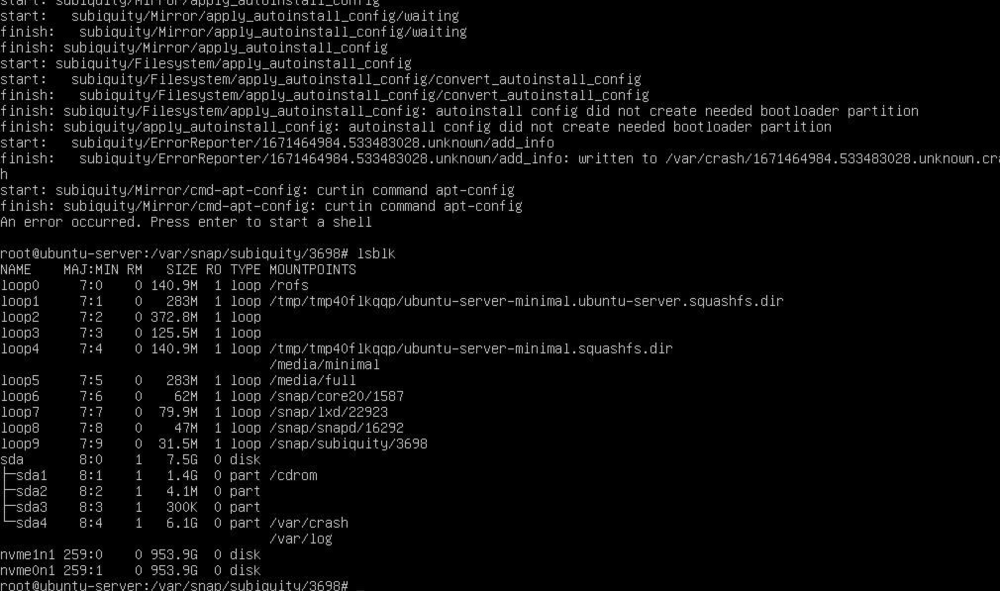

# Cloud in a Box

Cloud in a Box is a minimalistic installation of OSISM with only services which are needed to
make it usable with Kubernetes. It is intended for use as a development
system on bare-metal or for use in edge environments.

For more information you can consult the [Testbed](https://docs.scs.community/docs/category/osism-testbed)
documentation. If you want to build a more complex enviornment have a look at the
[OSISM](https://docs.osism.tech/) documentation.

:::warning

The secrets are stored in plain text and are not secure. Do not use for public
accessible systems.

:::

## Requirements

* The first blockdevice is available as `/dev/sda` or `/dev/nvme0n1`.
* USB stick with at least 2 GByte capacity.
* CPU: 1 socket, 4 cores
* RAM: 32 GByte
* Storage: 1 TByte
* Network: 1 network interface (optional: 2nd network interface for external connectivity)

## Installation

1. Download the Cloud in a Box image.

   :::warning

   When booting from this image, all data on the hard disks will be destroyed
   without confirmation.

   :::

   * <https://minio.services.osism.tech/node-image/ubuntu-autoinstall-cloud-in-a-box-1.iso> (with /dev/sda)
   * <https://minio.services.osism.tech/node-image/ubuntu-autoinstall-cloud-in-a-box-2.iso> (with /dev/nvme0n1)

2. Use a tool like balenaEtcher or dd to create a bootable USB stick with the Cloud
   in a Box image.

3. Boot from the USB stick. Make sure that the boot from USB is activated in the BIOS.

4. The installation will start and take a few minutes. After that the system will shutdown.

5. Remove the USB stick and restart the system.

6. The deployment will start. This takes some time and the system will shutdown when the
   deployment is finished. This takes roughly an hour, possibly longer depending on the
   hardware and internet connection.

7. System is ready for use, by default DHCP is tried on the first network device.

8. Login via ssh. Use the user **dragon** with the password **password**.

```bash
ssh dragon@IP_FROM_YOUR_SERVER
```

## Connectivity with Wireguard

Copy the `/home/dragon/wireguard-client.conf` file to your workstation. This is necessary
for using the web endpoints on your workstation. Rename the wireguard config file to something
like `cloud-in-a-box.conf`.

If you want to connect to the Cloud in a Box system from multiple clients, change the client IP
address in the config file to be different on each client.

```bash
scp dragon@IP_FROM_YOUR_SERVER:/home/dragon/wireguard-client.conf /home/ubuntu/cloud-in-a-box.conf
```

Install wireguard on your workstation, if you have not done this before. For instructions how to do
it on your workstation, please have a look on the documentation of your used distribution. The
wireguard documentation you will find [here](https://www.wireguard.com/).

Start the wireguard tunnel.

```bash
wg-quick up /home/ubuntu/cloud-in-a-box.conf
```

## Usage

Now your Cloud in a Box is up and you can reach the most services via the Homer dashboard:
<https://homer.services.in-a-box.cloud>

If you want to access the services please choose the URL from the following list:

| Name                    | URL                                           | Username   | Password  |
|-------------------------|-----------------------------------------------|------------|-----------|
| ARA                     | <https://ara.services.in-a-box.cloud>         | ara        | password  |
| Flower                  | <https://flower.services.in-a-box.cloud>      | -          | -         |
| Grafana                 | <https://api.in-a-box.cloud:3000>             | admin      | password  |
| Homer                   | <https://homer.services.in-a-box.cloud>       | -          | -         |
| Horizon - admin project | <https://api.in-a-box.cloud>                  | admin      | password  |
| Horizon - test project  | <https://api.in-a-box.cloud>                  | test       | test      |
| OpenSearch Dashboards   | <https://api.in-a-box.cloud:5601>             | opensearch | password  |
| Netbox                  | <https://netbox.services.in-a-box.cloud>      | admin      | password  |
| Netdata                 | <http://manager.systems.in-a-box.cloud:19999> | -          | -         |
| phpMyAdmin              | <https://phpmyadmin.services.in-a-box.cloud>  | root       | password  |
| RabbitMQ                | <https://api.in-a-box.cloud:15672>            | openstack  | password  |

:::note

Netdata is currently only usable via HTTP and not via HTTPS.

:::

### OpenStack CLI

Connect to your Cloud in a Box via **ssh** (see command above).

Select one of the preconfigured environments `system`, `admin`, or `test`
by exporting the environment variable `OS_CLOUD`:

```bash
export OS_CLOUD=admin
openstack server list
```

### Import of additional images

For example to import the Garden Linux image this command can be used:

```bash
export OS_CLOUD=admin
osism manage images --filter 'Garden Linux'
```

All available images: <https://github.com/osism/openstack-image-manager/tree/main/etc/images>

## Troubleshooting



This error means that your disk setup is broken. Use `cfdisk` and delete all partitions on
the system on which you want to install the Cloud in a Box image.

With `lsblk` you can verify if the partitions are empty.

## Upgrade

To upgrade the Cloud-in-a-Box, proceed as follows. It is best to execute the commands within a
screen session, it takes some time. Please note that you cannot update the Ceph deployment at
the moment. This will be enabled in the future.

```bash
osism apply configuration
/opt/configuration/upgrade.sh
docker system prune -a
```

## Notes

If you have found a bug, a feature is missing or you have a question just open an issue on GitHub
in [osism/cloud-in-a-box](https://github.com/osism/cloud-in-a-box/issues). We will have a look on
it as soon as it is possible.
